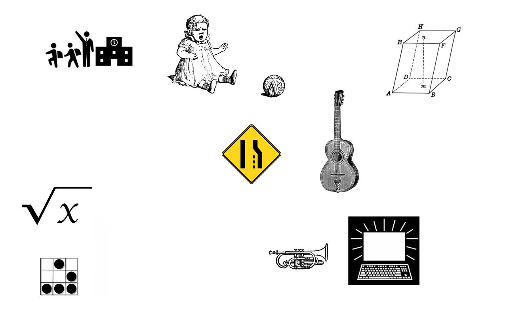
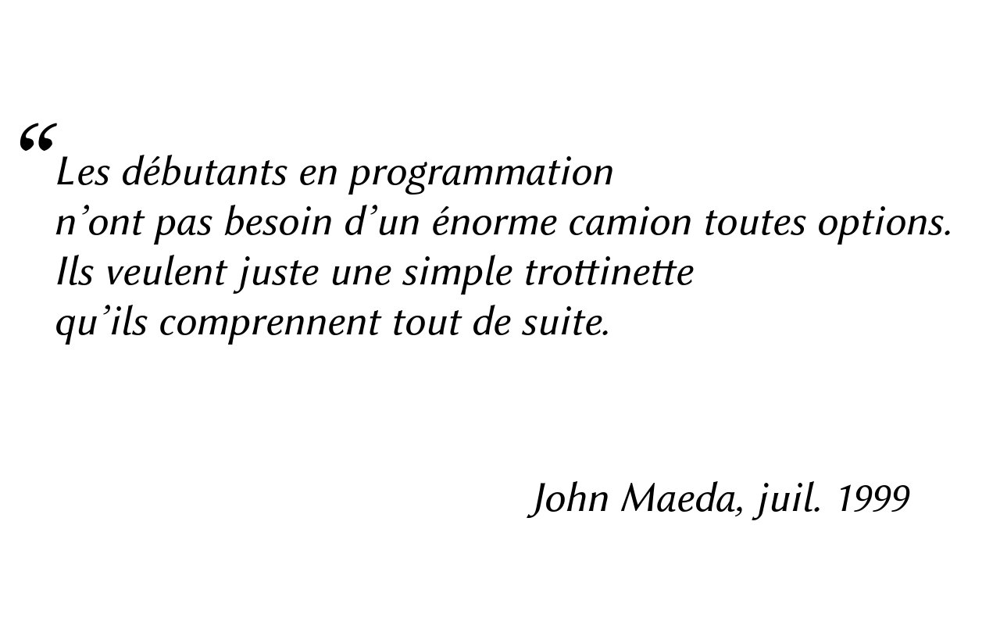
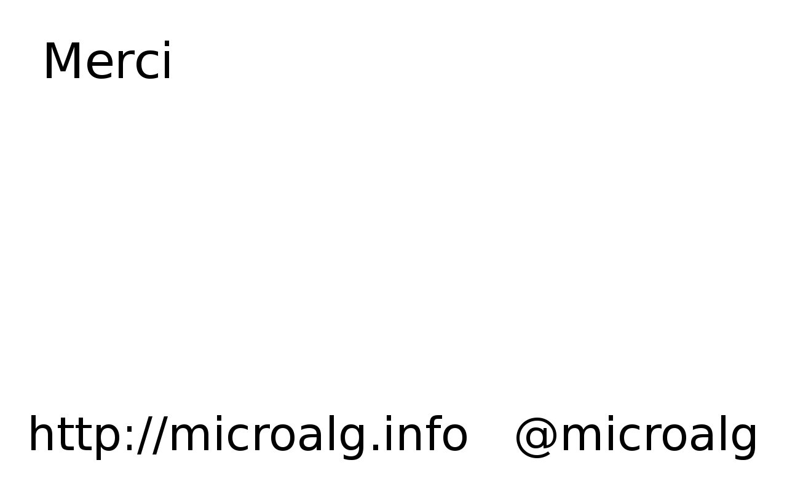

Notes:

* Je voulais, avec cette diapo, poser l’ambiance.
* Je suis prof de maths.
* En soirée, je détestais qu’on m’« introduise » de cette façon.
* Je suis même prof d’informatique, mais on ne sait pas si c’est mieux.

---

Notes:

* Au bout de quelques minutes, j’arrivais à redresser la situation.
* Autres intérêts :
    * plus ou moins tout, un peu d’humour,
    * musique
        * bcp d’instrus différents : guitare basse trompette batterie clarinette et chant
        * méthode de musique
    * sciences et bidouille
    * volley (bcp appris, rétrospectivement),

---

Notes:

* Et puis finalement, il faut bien opérer un focus sur le plus important.
* Notre petit foyer.
* Guitare et trompette, finalement méthode à l’abandon (un prochain PK?).
* Le boulot : enseigner les maths en lycée.
* Et finalement enseigner l’informatique (algo 2nde, ISN, BTS SIO, dev, Android).
* CPC en 6ème, Calto en 4ème étaient des prémisses.

---

Notes:

* Qu’est-ce qu’un algorithme ?
    * Suite d’instructions données pour atteindre un certain but,
      un peu comme une recette de cuisine.
* Attention, rédiger un algorithme est un acte créatif !
* Rôle de l’algorithmique (algo) :
    * Citoyen du monde numérique. Les bases sont à la portée de tous, il faut juste les diffuser. Ce n’est pas nouveau : Coding Goûters, associations intervenant au sein de l’Éduc. Nationale (l’EN aurait un rôle à jouer).
    * Installations artistiques interactives. Les artistes peuvent devenir plus conscients du rôle du code, plus indépendants dans la réalisation, voire des nouvelles voies de créations peuvent être ouvertes.

---

Notes:

* État de l’art, mes outils de travail : Algobox, Scratch, Processing, Python, Javascript…
* Tous ont des avantages, mais aussi des inconvénients (voir comparatif sur le web)
* Idée au printemps 2012, maturation en tiroir
* Codaz au printemps 2014

---

Notes:

* MicroAlg, l’objet de cette présentation
* Langage et environnements pour travailler l’algorithmique
* M’occupe bien
* Me le rend bien
* Je compte conquérir des parts dans la péda algo, doubler par la droite
  les concurrents de la diapo précédente
* MicroAlg est gratuit, ouvert, libre et jeune
    * d’où des points négatifs : il a des limitations
    * et des points positifs : il est ouvert aux idées

---

Notes:

* Citation relevée a posteriori, décrit parfaitement le projet
* J.Maeda
    * artiste, graphiste, enseignant et chercheur de renommée internationale
    * dirige le département Aesthetics and Computing Group
    * prof des étudiants Ben Fry et Casey Reys qui ont créé Processing
        * le langage destiné (en gros) aux artistes,
        * langage dont on va encore parler car MicroAlg peut communiquer avec

---

Notes:

* diapo un peu technique
* MicroAlg peut tourner presque partout
    * là où Java et JS tournent (desktop, tablettes)
    * là où C tourne (embarqué, \*duino et consorts)
    * on peut imaginer des écrans LCD ou à diodes, petits ou grands
    * surtout dans le navigateur

---

Notes:

* Pour ceux qui ont un navigateur sur eux
* Plutôt que de faire autre chose
* C’est le moment d’essayer MicroAlg en live
* Pour une fois que j’autorise les mobiles en cours…
* Levez la main ceux qui vont le faire

---

Notes:

* Espace de travail dans un navigateur
* On peut avoir :
    * que les blocs,
    * que le code textuel,
    * les deux (mise à jour en direct, ceux qui manipulent peuvent l’observer).
* Pas d’install, pas de communication avec le serveur.

---

Notes:

* Travail avec le texte pour ceux qui ont peur des maths
* Parenthèses arc-en-ciel
* Boucles, tirages au sort
* Affichage HTML
* Mais aussi variables et conditionnelles bien sûr

---

Notes:

* À quoi ça sert ?
* Pour quel public ?
* Pourquoi présenter MicroAlg à PK ?

---

Notes:

Speaker notes for slide 13.

---

Notes:

Speaker notes for slide 14.

---

Notes:

Speaker notes for slide 15.

---

Notes:

Speaker notes for slide 16.

---

Notes:

Speaker notes for slide 17.

---

Notes:

* Je cherche des « clients », c’est-à-dire :
    * des apprenants, donc vous ou vos enfants
    * des profs qui voudraient intégrer MicroAlg à :
        * un projet pédagogique
        * leur site professionnel ou utiliser la galerie
    * des artistes ayant un projet artistique, visuel, interactif, robotique
        * MicroAlg étant visible pour l’utilisateur ou non

---

Notes:

* Je cherche aussi des « contributeurs » pour améliorer :
    * les visuels
    * le site
    * la documentation
    * les outils autour de MicroAlg (éditeurs de code, liens avec d’autres projets informatiques…)
    * voire le langage lui-même
* Il est possible d’être à la fois client et contributeur !

---

Notes:

* Il me reste 20 secondes pour :
    * Remercier
        * Merci PK
        * Pour les visuels, remercier
            * http://pictogram2.com
            * http://etc.usf.edu/clipart/
            * http://publicdomainvectors.org/
            * mon voisin
        * Vous remercier pour votre attention
    * Conclure sur la Création
        * le but ultime qui nous réuni ce soir
        * Longue vie à la création (d’algos créatifs)
    * Cartes de visite, cocktail pour discussion
